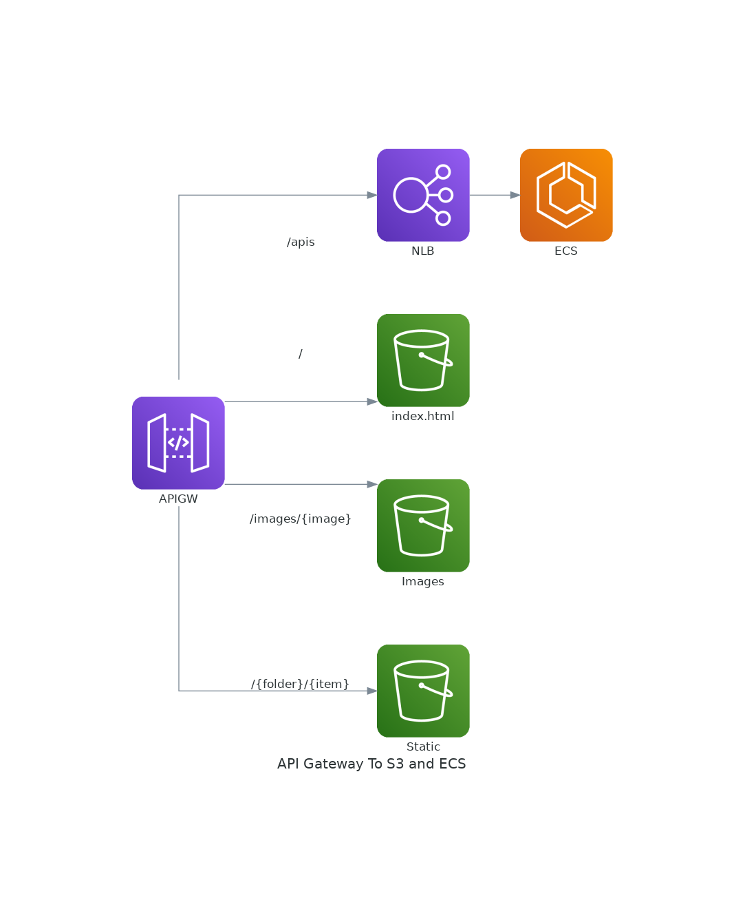

# Sample project for using API gateway to front S3 for static content and a service in ECS Fargate.

## Diagram


## Overview

This project uses the AWS CDK to generate and deploy cloudormation. To Deploy, you can run the command `cdk deploy` from within the directory (you will need to [install cdk](https://docs.aws.amazon.com/cdk/latest/guide/getting_started.html) `npn imstall -g aws-cdk`). 

## Objectives
- *Keep it private.* For demo purposes, the APIGateway is public, but everything else is private: S3, the NLB, and ECS. You can change the API Gateway peice to be private as well. 
- *Keep it serverless*  Everything here is serverless. 

## Considerations

- Depending on how the services are actually setup, this may not be the best implementation. It is also possible to use an ALB to do path based routing to multiple services in a private mode from API Gateway.
- This does not upload any files to s3. You will need to add those manually.  


# Welcome to your CDK Python project!

This is a blank project for Python development with CDK.

The `cdk.json` file tells the CDK Toolkit how to execute your app.

This project is set up like a standard Python project.  The initialization
process also creates a virtualenv within this project, stored under the .env
directory.  To create the virtualenv it assumes that there is a `python3`
(or `python` for Windows) executable in your path with access to the `venv`
package. If for any reason the automatic creation of the virtualenv fails,
you can create the virtualenv manually.

To manually create a virtualenv on MacOS and Linux:

```
$ python3 -m venv .env
```

After the init process completes and the virtualenv is created, you can use the following
step to activate your virtualenv.

```
$ source .env/bin/activate
```

If you are a Windows platform, you would activate the virtualenv like this:

```
% .env\Scripts\activate.bat
```

Once the virtualenv is activated, you can install the required dependencies.

```
$ pip install -r requirements.txt
```

At this point you can now synthesize the CloudFormation template for this code.

```
$ cdk synth
```

To add additional dependencies, for example other CDK libraries, just add
them to your `setup.py` file and rerun the `pip install -r requirements.txt`
command.

## Useful commands

 * `cdk ls`          list all stacks in the app
 * `cdk synth`       emits the synthesized CloudFormation template
 * `cdk deploy`      deploy this stack to your default AWS account/region
 * `cdk diff`        compare deployed stack with current state
 * `cdk docs`        open CDK documentation

Enjoy!
